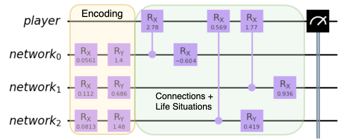

# Your Wonderland, Alice

## Introduction
What if you could figure out exactly who you needed to meet to move up the career ladder?
What if you could network with colleagues, without the actual hassle of having to touch grass?
What if, PROFESSIONAL NETWORKING was quantum??
Welcome to "Your Wonderland, Alice" – a unique storytelling experience that merges the fascinating world of quantum mechanics with the intricacies of everyday life.

## The Quantum Conundrum

In this project, we invite you to explore a world where the fabric of reality is woven with quantum threads, and the act of networking is a quantum phenomenon. Picture this: What if you could figure out who exactly you need to connect to and meet to climb up the career ladder? What if you choose your best-fit peers that lead you to success?

### Problem Statement

Dive into the realm of quantum mechanics with a twist of science fiction. Imagine a world where common experiences, such as friendship, exhibit quantum interference and entanglement. Your mission is to craft a narrative rooted in this quantum reality, blending creativity with a solid scientific simulation using a quantum computer.

### Solution Overview

### Project Name: Your Wonderland, Alice

### Synopsis

In "Your Wonderland, Alice," we present a compelling narrative that transforms the act of networking into a quantum phenomenon. Using quantum algorithms and circuits, we simulate the dynamics of building connections in the professional world. The story unfolds as the player navigates through a quantum-inspired reality, making connections with individuals whose personalities, career positions, and even home-company stock prices influence the quantum entanglement between them.

### Gameplay

1. **Simulation of Networking**: Each potential network candidate is represented as a qubit, with their personality encoded using random parametrized r-gates (yellow gates in the circuit).

2. **Quantum Entanglement**: The entangling gates (green gates) simulate the connections between individuals. We use one entangling gate per time step, gradually increasing the number of connections the player makes over time.

3. **Weighted Connections**: The entanglement between two qubits is generalized into two people connecting with each other. Each connection is weighted based on the player's perception of the other person, considering factors such as personality, career position, and home-company stock price.

4. **Success Criteria**: The player's success in the future is determined by the average state of their qubits. A state of '0' indicates failure, while '1' signifies success. The circuit is designed to stabilize over time, influencing the player's success through strategic networking.

5. **Dynamic Events**: Each person in the quantum narrative may undergo events that alter their personality or social influence, introducing unpredictability and excitement to the storyline.

### Circuit Construction

  

1. **Phase 1 - Personality Encoding**: Random parametrized r-gates (yellow gates) encode the personality of each potential network candidate into their respective qubits.

2. **Phase 2 - Entangling Connections**: Entangling gates (green gates) represent the influence and connection between individuals. The circuit evolves over multiple time steps, increasing the number of connections and their impact on the player's quantum state.

## Getting Started

Follow these steps to experience "Your Wonderland, Alice":

To run a simulation of possible interactions:
1. Navigate to the 'simulation' folder and run `backend_sim.ipynb`.
2. You should be able to see Alice's social interaction graphs grow with time!

To run a game with possible interactions:
1. Navigate to the 'game' folder and run `backend_game.py`.
2. You should be able to make decisions from the perspective of Alice, running on a quantum simulator backend!

See PDF for the full storyline of Alice!

## Contributors

- [Andrea Miramontes Serrano](https://github.com/Andrea-MiramonSerr)
- [Nelson Ooi](https://github.com/NelsonOoi)
- [Samyam Lamichhane](https://github.com/declansam)
- [Sarthak Prasad Malla](https://github.com/Sarthak-Malla/)
- [Sasha Malik](https://github.com/Sasha-Malik)

Enjoy your adventure in Wonderland!
Professional networking, now made quantum. (TM)
